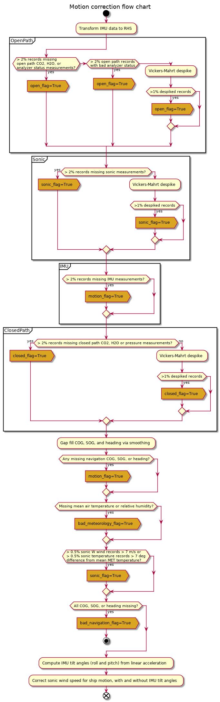

fluxer.eddycov package
======================

Processing flow chart
---------------------

The first step is to correct data for ship motion effects:

|image0|

Vector rotation conventions
---------------------------

The coordinates of a vector :math:`i` in coordinate system :math:`k`,
i.e. :math:`\vec{v}_{i,k}`, can be expressed in or transformed to a
different coordinate system by multiplication with a rotation matrix
:math:`R_n` around axis :math:`n`.  In a right-handed coordinate system,
*positive* rotation of the **coordinate system** around a coordinate axis
is *clockwise* when looking along rotation axis from the origin towards the
positive direction.  A single rotation around the :math:`x`, :math:`y`, or
:math:`z` axis is performed by pre-multiplying the corresponding rotation
matrix:

.. math::
   :label: rot_mats

   \begin{align*}
   R_{x,\theta} &=
   \begin{bmatrix}
   1 & 0 & 0 \\
   0 & \cos \theta & \sin \theta \\
   0 & -\sin \theta & \cos \theta
   \end{bmatrix} &
   R_{y,\theta} &=
   \begin{bmatrix}
   \cos \theta & 0 & -\sin \theta \\
   0 & 1 & 0 \\
   \sin \theta & 0 & \cos \theta
   \end{bmatrix} &
   R_{z,\theta} &=
   \begin{bmatrix}
   \cos \theta & \sin \theta & 0 \\
   -\sin \theta & \cos \theta & 0 \\
   0 & 0 & 1
   \end{bmatrix}
   \end{align*}

by column vector :math:`\vec{v}_{i,k}`.  For instance, rotating vector
:math:`\vec{v}_{i,k}`'s coordinates from coordinate system :math:`0` to
coordinate system :math:`1` around the vertical :math:`z` axis is defined
as:

.. math::
   \begin{equation}
   \vec{v}_{i,1} = R_{z,\theta} \vec{v}_{i,0}
   \end{equation}

This particular definition is known as "passive" or "alias" rotation.
Alternatively, the same rotation can be achieved by post-multiplying the
row vector :math:`\vec{v}_{i,k}` by the inverse (or transpose, in
orthogonal matrices such as these) of the rotation matrix in equation
:eq:`rot_mats`:

.. math::
   :label: post_mul_rot

   \begin{equation}
   \vec{v}_{i,1} = \vec{v}_{i,0} R_{z,\theta}^\intercal
   \end{equation}

Using :math:`R_{z,\theta}` instead of the inverted (transposed) matrix
results in what is known as an "active" or "alibi" rotation of the
**vector** in the opposite direction (i.e. *counterclockwise* using the
convention described above) in the same fixed coordinate system.
Equation :eq:`post_mul_rot` is computationally more convenient, as vector
data are typically acquired and stored in rows, so this is the convention
adopted in :mod:`~fluxer.eddycov`.  Figure :ref:`1 <sonic rotation demo>`
illustrates this operation for a commonly used rotation to eliminate the
angular offset of an anemometer relative to the main longitudinal axis of
the platform where it was mounted.

.. _sonic rotation demo:

.. plot:: scripts/sonic_anemometer_rotation_simul.py

Module contents
---------------

.. automodule:: fluxer.eddycov
    :members:
    :undoc-members:
    :show-inheritance:

Submodules
----------

:mod:`~fluxer.eddycov.parse_ecfile`
~~~~~~~~~~~~~~~~~~~~~~~~~~~~~~~~~~~

.. automodule:: fluxer.eddycov.parse_ecfile
    :members:
    :undoc-members:
    :show-inheritance:

:mod:`~fluxer.eddycov.settings`
~~~~~~~~~~~~~~~~~~~~~~~~~~~~~~~

.. automodule:: fluxer.eddycov.settings
    :members:
    :undoc-members:
    :show-inheritance:

:mod:`~fluxer.eddycov.tilt_windows`
~~~~~~~~~~~~~~~~~~~~~~~~~~~~~~~~~~~

.. automodule:: fluxer.eddycov.tilt_windows
    :members:
    :undoc-members:
    :show-inheritance:
